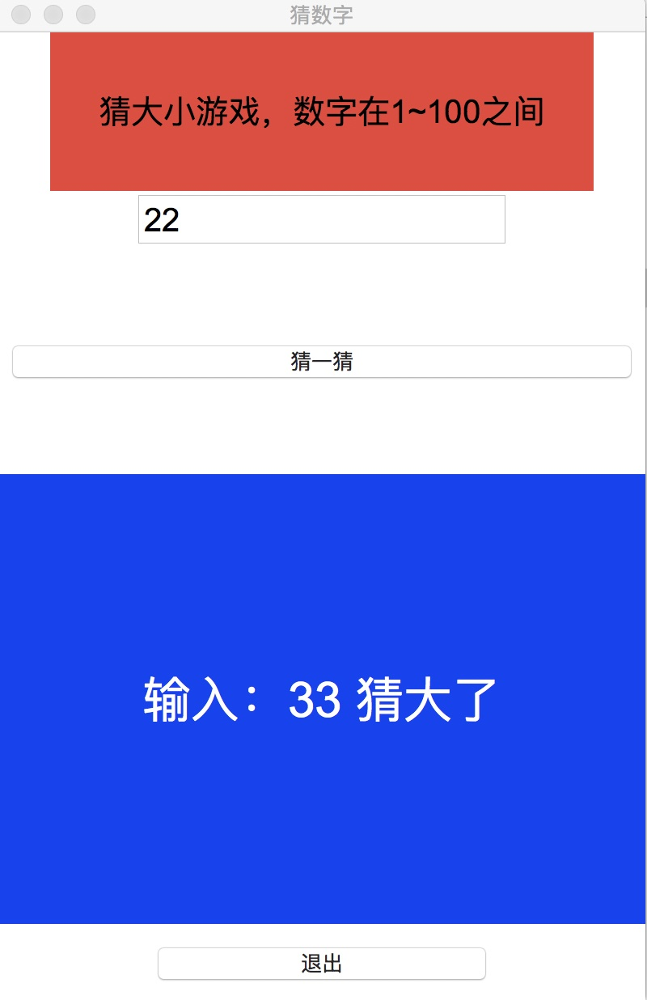

# guess.py



## Example

```
python3 guess.py
```

## Requirements

ptyhon3
tkinter

 

## Author

sunwenlong

## License

guess.py is available under the MIT license. See the LICENSE file for more info.
